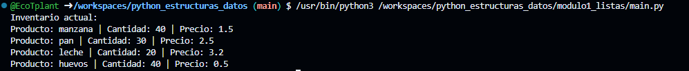
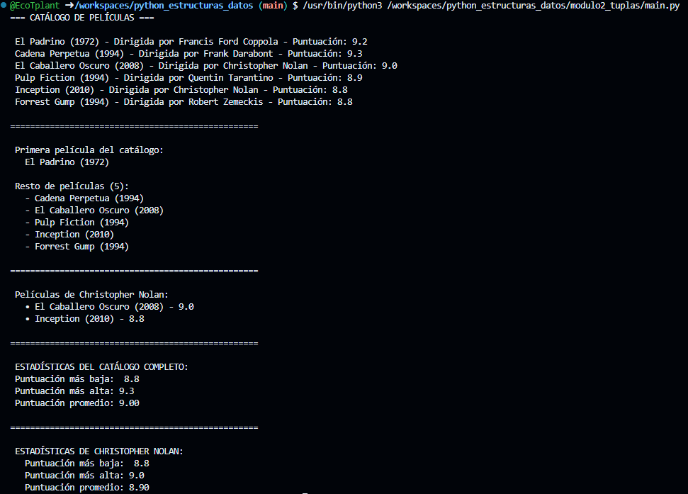
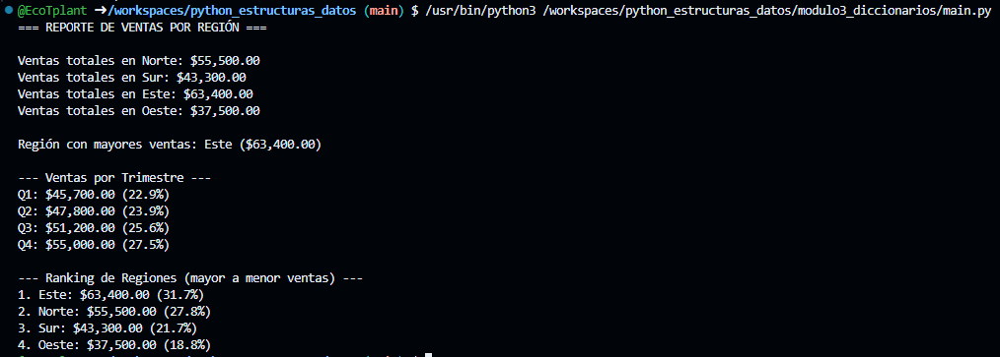
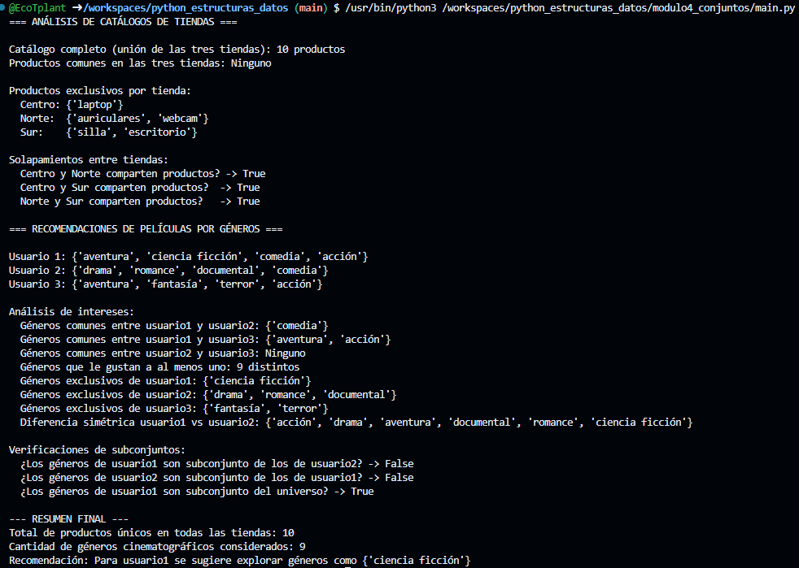
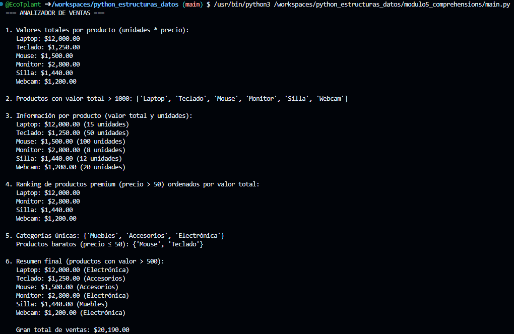

# Proyecto: Estructuras de Datos en Python

## Descripción del proyecto

Este proyecto consiste en la implementación de cinco módulos prácticos que cubren las principales estructuras de datos en Python: **listas**, **tuplas**, **diccionarios**, **conjuntos** y **comprehensions**. Cada módulo resuelve un problema real aplicando las características propias de cada estructura, con énfasis en inmutabilidad, desempaquetado, operaciones de conjuntos, comprensiones y gestión de datos anidados.

El objetivo es demostrar el dominio de estas estructuras a través de la construcción de programas funcionales: un sistema de inventario, un catálogo de películas, un análisis de ventas por región, un sistema de recomendaciones de películas y un analizador de ventas con comprehensions.

---

## Temas aprendidos

### Módulo 1: Listas
- Creación y acceso a listas anidadas.
- Métodos: `append()`, `insert()`, `extend()`, `remove()`, `pop()`, `sort()`.
- Slicing y modificación in‑place.
- Recorrido con `for`, `enumerate()` y `zip()`.
- Copias superficiales vs profundas (`copy()`, `deepcopy()`).

### Módulo 2: Tuplas
- Inmutabilidad y su impacto en la seguridad de datos.
- Desempaquetado básico y con operador `*`.
- Métodos `count()` e `index()`.
- Uso de tuplas como claves en diccionarios.
- Creación de tuplas unitarias (con coma final).

### Módulo 3: Diccionarios
- Estructura clave‑valor, claves hashables.
- Métodos: `items()`, `keys()`, `values()`, `get()`, `update()`, `pop()`.
- Iteración segura (sin modificar durante el recorrido).
- Diccionarios anidados y acceso profundo.
- Uso de `sorted()` con `key=lambda`.

### Módulo 4: Conjuntos (Sets)
- Eliminación automática de duplicados.
- Operaciones de teoría de conjuntos: unión (`|`), intersección (`&`), diferencia (`-`), diferencia simétrica (`^`).
- Métodos: `add()`, `remove()`, `discard()`, `isdisjoint()`, `issubset()`.
- Verificación rápida de pertenencia (`in`).

### Módulo 5: Comprehensions
- List comprehension: transformación y filtrado en una línea.
- Dict comprehension: construcción de diccionarios desde iterables.
- Set comprehension: obtención de elementos únicos.
- Combinación de las tres comprehensions en un mismo análisis.
- Comparación de rendimiento frente a bucles tradicionales.

---

## Evidencia de retos resueltos

Los siguientes programas han sido implementados y probados correctamente. Cada uno se encuentra en la carpeta correspondiente dentro de `python_estructuras_datos/`.

| Módulo | Archivo | Descripción |
|--------|---------|-------------|
| Listas | `modulo1_listas/inventario.py` | Sistema de gestión de inventario con operaciones de actualización de precio, venta, adición de productos y visualización. |
| Tuplas | `modulo2_tuplas/catalogo_peliculas.py` | Catálogo de películas usando tuplas inmutables, desempaquetado, separación con `*`, búsqueda por director y estadísticas. |
| Diccionarios | `modulo3_diccionarios/ventas_region.py` | Análisis de ventas trimestrales por región, cálculo de totales, región con mayores ventas, porcentajes por trimestre y ranking ordenado. |
| Conjuntos | `modulo4_conjuntos/tiendas_recomendaciones.py` | Análisis de catálogos de tiendas con operaciones de conjuntos y recomendaciones de películas basadas en géneros (operadores `&`, `|`, `-`, `^`, `<=`). |
| Comprehensions | `modulo5_comprehensions/analizador_ventas.py` | Uso combinado de list, dict y set comprehensions para calcular valores totales, filtrar productos destacados, generar rankings y obtener estadísticas. |

Cada script incluye su propio conjunto de pruebas (llamadas a funciones y salida por consola) que demuestran el correcto funcionamiento.

---

## Capturas de ejecución

Las siguientes imágenes muestran la salida en consola de cada módulo. Se encuentran almacenadas en la carpeta `images/`.

### Módulo 1 – Gestión de inventario (listas)

### Módulo 2 – Catálogo de películas (tuplas)

### Módulo 3 – Análisis de ventas por región (diccionarios)

### Módulo 4 – Tiendas y recomendaciones (conjuntos)

### Módulo 5 – Analizador de ventas (comprehensions)

## Reflexión personal del aprendizaje

Este recorrido por las estructuras de datos de Python me ha permitido consolidar conceptos fundamentales y apreciar la riqueza expresiva del lenguaje.

- **Listas**: Me resultó muy útil entender la diferencia entre `append()` y `extend()`, así como la importancia de `deepcopy()` cuando se trabaja con listas anidadas. El ejercicio de inventario me hizo valorar la mutabilidad controlada.
- **Tuplas**: Aunque inicialmente las veía como “listas inmutables”, aprendí a aprovechar su desempaquetado y el uso del operador `*` para capturar el resto de elementos. La imposibilidad de modificarlas aporta seguridad en contextos donde los datos no deben cambiar (por ejemplo, coordenadas o configuraciones).
- **Diccionarios**: Fue un reto interesante calcular estadísticas a partir de diccionarios anidados. El uso de `items()` junto con `sorted()` y `lambda` me pareció muy elegante para generar rankings. Además, comprender que las claves deben ser inmutables me ayudó a evitar errores futuros.
- **Conjuntos**: Descubrí lo potentes que son para operaciones de comparación entre colecciones. Resolver el ejercicio de tiendas y recomendaciones me facilitó entender la unión, intersección y diferencia simétrica de manera práctica. La comprobación de subconjuntos (`<=`) es muy legible para validar relaciones.
- **Comprehensions**: Al principio me costaba leer las comprensiones anidadas, pero después de practicar con el analizador de ventas, me di cuenta de que reducen drásticamente el código y, en muchos casos, mejoran el rendimiento. Aprendí a decidir cuándo usar una comprehension y cuándo es mejor un bucle tradicional (cuando la lógica es demasiado compleja).

En conjunto, este proyecto me ha dado herramientas para elegir la estructura de datos más adecuada según el problema, escribiendo código más limpio, eficiente y mantenible. La combinación de teoría y ejercicios prácticos ha sido clave para interiorizar estos conceptos.
